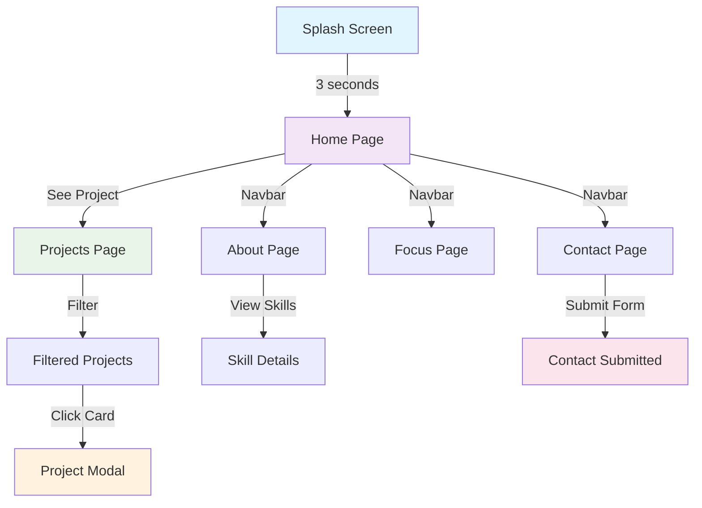
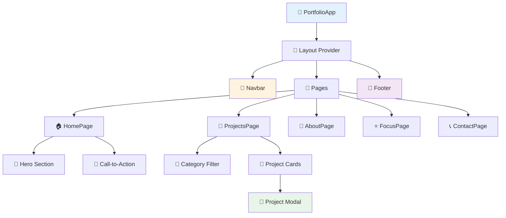
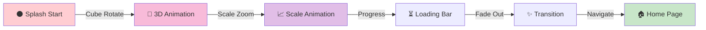

<h1 align="center">Flutter Interactive Portfolio 🚀</h1>

<p align="center">
  
  
  
  
</p>

---

## 🎯 Overview

**Flutter Interactive Portfolio** adalah aplikasi web portfolio modern berbasis Flutter yang menampilkan proyek-proyek berkualitas tinggi dengan antarmuka interaktif, animasi 3D yang memukau, dan desain responsif. Portfolio ini dirancang khusus untuk menampilkan keahlian dalam mobile development, web development, AI & Robotics, dan IoT.

Fitur unggulan termasuk splash screen dengan 3D cube rotation, navbar yang dinamis dengan dark/light mode, hero section dengan typing animation, project filtering system, dan contact form yang terintegrasi.

---

## ✨ Fitur Utama

### 🎪 Splash Screen
- **3D Cube Rotation** - Animasi kubus 3D yang berputar pada berbagai sumbu untuk menciptakan tech vibe
- **Scale Animation** - Efek zoom in dan zoom out yang smooth untuk transisi visual yang menawan
- **Loading Bar** - Progress indicator dengan animasi halus
- **Auto Navigation** - Navigasi otomatis ke halaman utama setelah 3 detik
- **Fade Out Effect** - Transisi fade out yang elegan saat berpindah ke homepage

### 🧭 Navbar & Navigation
- **Responsive Design** - Menyesuaikan dengan ukuran layar desktop dan mobile
- **Dark/Light Mode Toggle** - Tema adaptif dengan smooth transitions
- **Smooth Navigation** - Navigasi antar halaman dengan animasi yang mulus
- **Active Link Indicator** - Menunjukkan halaman aktif dengan visual feedback

### 🌟 Hero Section
- **Typing Animation** - Teks yang diketik secara otomatis menciptakan efek dinamis
- **Call-to-Action Button** - Button "See Project" yang prominent dan mudah diklik
- **Gradient Background** - Background yang menarik dengan color scheme profesional
- **Responsive Layout** - Optimal di semua ukuran layar

### 📁 Projects Management
- **Category Filtering** - Filter proyek berdasarkan kategori (All, Mobile, Web, AI & Robotics, AI & ML, IoT)
- **Animated Cards** - Kartu proyek dengan hover effects dan transitions
- **Project Modal** - Detail proyek lengkap dengan screenshot, deskripsi, tech stack, dan link
- **Smooth Transitions** - Animasi kategori filter yang halus

### 👤 About & Skills
- **Personal Bio** - Penjelasan lengkap tentang latar belakang dan visi
- **Skill Badges** - 9 badge skill dengan hover animation dan tooltips
- **Tech Stack Showcase** - Display teknologi dan tools yang dikuasai

### 📋 Focus Page
- **Tech Stack Display** - Daftar teknologi yang sedang fokus dipelajari
- **Areas of Interest** - Bidang utama minat profesional

### 📞 Contact Page
- **Contact Information** - Email, telepon, dan alamat
- **Social Links** - Integrasi dengan WhatsApp, GitHub, Instagram
- **Contact Form** - Form komunikasi dengan validasi input
- **Professional Layout** - Desain kontak yang elegan dan mudah diakses

---

## 📋 Requirements

### Development Environment
- Flutter SDK (>=3.10.0)
- Dart SDK (>=3.0.0)
- Chrome Browser (untuk web development)
- Android Studio / VS Code / IntelliJ IDEA
- Git

### System Requirements
- RAM minimal 4GB
- Storage minimal 2GB untuk Flutter SDK
- Koneksi internet untuk dependencies

### Dependencies
```yaml
dependencies:
  flutter:
    sdk: flutter
  cupertino_icons: ^1.0.2
  flutter_cube: ^0.0.5           # 3D cube rendering
  google_fonts: ^6.0.0           # Google Fonts integration
  url_launcher: ^6.2.0           # URL handling
  flutter_svg: ^2.0.8            # SVG support
  http: ^1.1.0                   # HTTP requests
  flutter_animate: ^4.2.0        # Smooth animations
  provider: ^6.1.0               # State management

dev_dependencies:
  flutter_test:
    sdk: flutter
  flutter_lints: ^3.0.0
```

---

## 🚀 Installation

### 1. Clone Repository
```bash
git clone https://github.com/ficrammanifur/flutter-interactive-portfolio.git
cd flutter-interactive-portfolio
```

### 2. Install Flutter (Jika belum)
```bash
# Download Flutter SDK dari https://flutter.dev/docs/get-started/install
# Atau gunakan FVM (Flutter Version Manager) untuk multiple versions:
fvm install 3.10.0
fvm use 3.10.0
```

### 3. Install Dependencies
```bash
# Get all dependencies
flutter pub get

# Install specific package (optional)
flutter pub add flutter_cube

# Update dependencies
flutter pub upgrade
```

### 4. Setup Project
```bash
# Clean project (recommended)
flutter clean

# Get dependencies again
flutter pub get

# Generate any required code
flutter pub run build_runner build
```

### 5. Run Application

#### For Web
```bash
# Run di browser dengan hot reload
flutter run -d chrome

# Build production web
flutter build web --release
```

#### For Android
```bash
# Run di Android emulator/device
flutter run

# Build APK
flutter build apk --release

# Build App Bundle
flutter build appbundle --release
```

#### For iOS (macOS only)
```bash
# Run di iOS simulator
flutter run -d ios

# Build iOS app
flutter build ios --release
```

---

## 📂 Project Structure

```
flutter-interactive-portfolio/
├── assets/                          # App assets
│   ├── images/                      # Image files
│   ├── icons/                       # Icon files
│   └── models_3d/                   # 3D model files
│
├── lib/
│   ├── main.dart                    # App entry point
│   ├── app.dart                     # Main app configuration
│   │
│   ├── themes/                      # Theme management
│   │   ├── theme_provider.dart      # Theme state provider
│   │   ├── light_theme.dart         # Light theme configuration
│   │   └── dark_theme.dart          # Dark theme configuration
│   │
│   ├── pages/                       # App pages/screens
│   │   ├── splash_screen.dart       # 3D splash screen
│   │   ├── home_page.dart           # Home page dengan hero section
│   │   ├── projects_page.dart       # Projects listing & filtering
│   │   ├── about_page.dart          # About page dengan skills
│   │   ├── focus_page.dart          # Tech stack & focus areas
│   │   └── contact_page.dart        # Contact information & form
│   │
│   ├── widgets/                     # Reusable components
│   │   ├── navbar.dart              # Navigation bar
│   │   ├── footer.dart              # Footer component
│   │   ├── project_card.dart        # Project card widget
│   │   ├── project_modal.dart       # Project detail modal
│   │   ├── typing_text.dart         # Typing animation widget
│   │   └── skill_badge.dart         # Skill badge component
│   │
│   ├── models/                      # Data models
│   │   ├── project_model.dart       # Project data model
│   │   └── skill_model.dart         # Skill data model
│   │
│   └── utils/                       # Utility functions
│       ├── constants.dart           # App constants
│       └── colors.dart              # Color palette
│
├── pubspec.yaml                     # Flutter dependencies
├── pubspec.lock                     # Locked dependency versions
├── README.md                        # This file
└── .gitignore                       # Git ignore rules
```

---

## 🎨 Design & UI Flow

### Navigation Flow Diagram


### Component Hierarchy


### Animation Flow


---

## 🎯 Key Features Implementation

### 1. 3D Splash Screen dengan Flutter Cube
```dart
// lib/pages/splash_screen.dart

import 'package:flutter_cube/flutter_cube.dart';

class SplashScreen extends StatefulWidget {
  @override
  State<SplashScreen> createState() => _SplashScreenState();
}

class _SplashScreenState extends State<SplashScreen>
    with TickerProviderStateMixin {
  late AnimationController _rotationController;
  late AnimationController _scaleController;

  @override
  void initState() {
    super.initState();
    _initializeAnimations();
    _navigateToHome();
  }

  void _initializeAnimations() {
    _rotationController = AnimationController(
      duration: Duration(seconds: 3),
      vsync: this,
    )..repeat();

    _scaleController = AnimationController(
      duration: Duration(seconds: 3),
      vsync: this,
    )..forward();
  }

  void _navigateToHome() {
    Future.delayed(Duration(seconds: 3), () {
      Navigator.of(context).pushReplacementNamed('/');
    });
  }

  @override
  Widget build(BuildContext context) {
    return Scaffold(
      body: Center(
        child: Column(
          mainAxisAlignment: MainAxisAlignment.center,
          children: [
            // 3D Cube animation
            ScaleTransition(
              scale: _scaleController,
              child: Cube(
                onSceneCreated: (Scene scene) {
                  // Cube setup
                },
              ),
            ),
            SizedBox(height: 40),
            // Loading bar
            LinearProgressIndicator(
              minHeight: 4,
              backgroundColor: Colors.grey[300],
              valueColor: AlwaysStoppedAnimation(Colors.blue),
            ),
          ],
        ),
      ),
    );
  }

  @override
  void dispose() {
    _rotationController.dispose();
    _scaleController.dispose();
    super.dispose();
  }
}
```

### 2. Typing Animation Component
```dart
// lib/widgets/typing_text.dart

class TypingText extends StatefulWidget {
  final String text;
  final Duration speed;

  const TypingText({
    required this.text,
    this.speed = const Duration(milliseconds: 100),
  });

  @override
  State<TypingText> createState() => _TypingTextState();
}

class _TypingTextState extends State<TypingText> {
  String displayedText = '';
  int currentIndex = 0;

  @override
  void initState() {
    super.initState();
    _startTyping();
  }

  void _startTyping() {
    Future.delayed(Duration(milliseconds: 500), () {
      _typeNextCharacter();
    });
  }

  void _typeNextCharacter() {
    if (currentIndex < widget.text.length) {
      setState(() {
        displayedText += widget.text[currentIndex];
        currentIndex++;
      });
      Future.delayed(widget.speed, _typeNextCharacter);
    }
  }

  @override
  Widget build(BuildContext context) {
    return Text(
      displayedText,
      style: Theme.of(context).textTheme.headlineSmall,
    );
  }
}
```

### 3. Dark/Light Theme Toggle
```dart
// lib/themes/theme_provider.dart

class ThemeProvider extends ChangeNotifier {
  bool _isDarkMode = false;

  bool get isDarkMode => _isDarkMode;

  void toggleTheme() {
    _isDarkMode = !_isDarkMode;
    notifyListeners();
  }

  ThemeData getTheme() {
    return _isDarkMode ? darkTheme : lightTheme;
  }
}
```

### 4. Project Filtering System
```dart
// lib/pages/projects_page.dart

class ProjectsPage extends StatefulWidget {
  @override
  State<ProjectsPage> createState() => _ProjectsPageState();
}

class _ProjectsPageState extends State<ProjectsPage> {
  String selectedCategory = 'All';

  List<Project> get filteredProjects {
    if (selectedCategory == 'All') return allProjects;
    return allProjects
        .where((p) => p.category == selectedCategory)
        .toList();
  }

  @override
  Widget build(BuildContext context) {
    return Column(
      children: [
        // Category filter
        Wrap(
          spacing: 10,
          children: ['All', 'Mobile', 'Web', 'AI & Robotics', 'AI & ML', 'IoT']
              .map((category) => FilterChip(
                    label: Text(category),
                    selected: selectedCategory == category,
                    onSelected: (selected) {
                      setState(() => selectedCategory = category);
                    },
                  ))
              .toList(),
        ),
        // Filtered projects grid
        GridView.builder(
          gridDelegate: SliverGridDelegateWithFixedCrossAxisCount(
            crossAxisCount: 3,
          ),
          itemCount: filteredProjects.length,
          itemBuilder: (context, index) =>
              ProjectCard(project: filteredProjects[index]),
        ),
      ],
    );
  }
}
```

---

## 🎮 Usage Guide

### Navigating the Portfolio
1. **Splash Screen** - Tunggu hingga animasi selesai (3 detik)
2. **Home Page** - Klik "See Project" untuk melihat daftar proyek
3. **Projects Page** - Gunakan filter kategori untuk memilah proyek
4. **Click Project Card** - Modal detail akan muncul dengan informasi lengkap
5. **Other Pages** - Gunakan navbar untuk navigasi ke About, Focus, Contact

### Customization
1. **Update Project Data** - Edit `lib/models/project_model.dart`
2. **Change Colors** - Modify `lib/utils/colors.dart`
3. **Add Skills** - Update `lib/pages/about_page.dart`
4. **Contact Info** - Edit `lib/pages/contact_page.dart`

---

## 🌐 Deployment

### Deploy ke Web (Vercel)
```bash
# Build untuk web
flutter build web --release

# Deploy ke Vercel
vercel

# atau gunakan GitHub Pages
# Push ke repo dan configure GitHub Pages
```

### Deploy ke App Store / Google Play
```bash
# Build APK untuk Android
flutter build apk --release

# Build App Bundle
flutter build appbundle --release

# Build untuk iOS
flutter build ios --release
```

---

## 🧪 Testing

```bash
# Run unit tests
flutter test

# Run integration tests
flutter test integration_test/

# Run dengan coverage
flutter test --coverage
```

---

## 📊 Performance Tips

1. **Image Optimization** - Gunakan WebP format untuk web
2. **Lazy Loading** - Load images saat dibutuhkan
3. **Code Splitting** - Pisahkan kode per page
4. **Cache Management** - Implement caching strategy
5. **Animation Performance** - Gunakan `SingleTickerProviderStateMixin`

---

## 🤝 Contributing

1. Fork repository
2. Create feature branch (`git checkout -b feature/amazing-feature`)
3. Commit changes (`git commit -m 'Add amazing feature'`)
4. Push to branch (`git push origin feature/amazing-feature`)
5. Open Pull Request

### Development Guidelines
- Follow Dart style guide
- Write meaningful commit messages
- Test sebelum submit PR
- Update documentation

---

## 📝 License

This project is licensed under the **MIT License** - see the [LICENSE](./LICENSE) file for details.

---

## 👤 Author

**[Ficrammanifur]** - *Portfolio Developer*
- GitHub: [@ficrammanifur](https://github.com/ficrammanifur)
- Email: ficramm@example.com
- Portfolio: [portfolio.com](https://portfolio.com)

---

## 🙏 Acknowledgments

- **Flutter & Dart** teams untuk framework yang awesome
- **Flutter Cube** untuk 3D rendering capabilities
- **Google Fonts** untuk typography options
- **Flutter Animate** untuk smooth animations
- **Provider** untuk state management solution
- Open source community untuk support dan resources

---

## 📞 Support

Jika ada pertanyaan atau issues:
1. Check existing issues di GitHub
2. Buat issue baru dengan deskripsi detail
3. Hubungi via email

---

<div align="center">
  
**Crafted with 🎨 and ❤️ using Flutter**

[⬆ Back to Top](#flutter-interactive-portfolio-)

</div>
