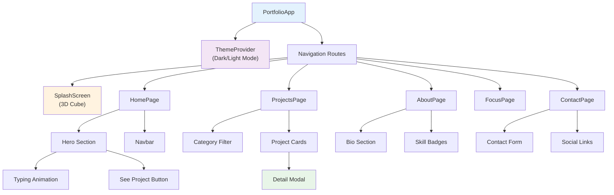
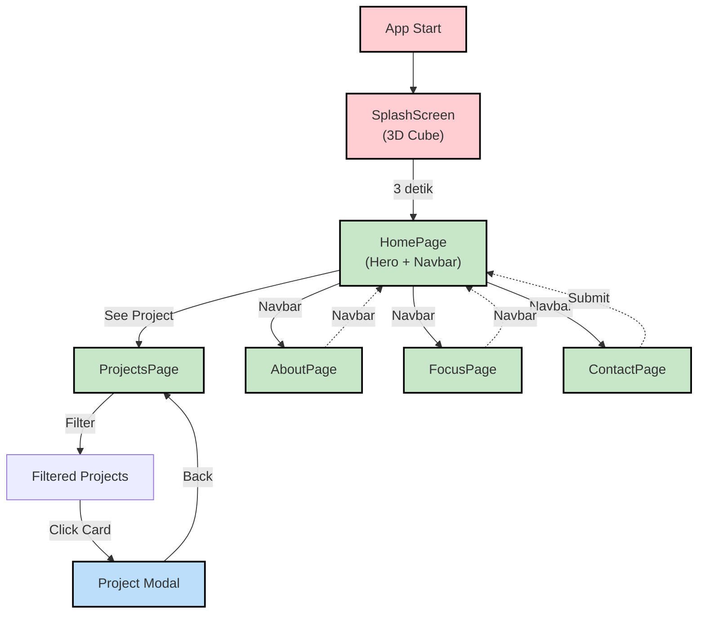

<h1 align="center">Flutter Interactive Portfolio 🚀</h1>

<p align="center">
  
  
  
  
</p>

<p align="center">
  <em>Portfolio web interaktif berbasis Flutter dengan 3D splash screen, dark/light mode, project filtering, dan animasi smooth yang menampilkan skill teknis dan project showcase profesional.</em>
</p>

---

## 📋 Daftar Isi

- [Mengapa Flutter untuk Portfolio](#-mengapa-flutter-untuk-portfolio)
- [Demo Singkat](#-demo-singkat)
- [Fitur Utama](#-fitur-utama)
- [Tech Stack & Dependencies](#-tech-stack--dependencies)
- [Arsitektur Aplikasi](#-arsitektur-aplikasi)
- [Alur Kerja & Navigation](#-alur-kerja--navigation)
- [Instalasi](#-instalasi)
- [Cara Menjalankan](#-cara-menjalankan)
- [Kustomisasi](#-kustomisasi)
- [Deployment](#-deployment)
- [Performance Tips](#-performance-tips)
- [Troubleshooting](#-troubleshooting)
- [Struktur Folder](#-struktur-folder)
- [Kontribusi](#-kontribusi)
- [Pengembang](#-pengembang)
- [Lisensi](#-lisensi)


---

## 🚀 Mengapa Flutter untuk Portfolio?

### Keunggulan Flutter Web Portfolio

| Fitur | Web Standar | Flutter Web | Keuntungan |
|-------|-------------|-------------|-----------|
| **Development Speed** | Lambat | ⚡ Cepat dengan hot reload | 2-3x lebih cepat |
| **Performance** | Bervariasi | Sangat optimized | 60 FPS animations |
| **Code Sharing** | Tidak | Ya (mobile & web) | One codebase |
| **Styling** | CSS kompleks | Dart-based styling | Lebih readable |
| **Animation** | Library eksternal | Built-in & powerful | Smooth 60 FPS |
| **Responsiveness** | Manual media query | Auto-responsive | Responsive by default |
| **State Management** | Complex | Sederhana | Provider, Riverpod, dll |

### Keunggulan Sistem Portfolio Flutter

✓ **3D Splash Screen** - Modern tech vibe dengan rotating 3D cube  
✓ **Dark/Light Mode** - Seamless theme switching dengan Provider  
✓ **Animasi Smooth** - 60 FPS animations dengan flutter_animate  
✓ **Project Filtering** - Filter by category dengan smooth transitions  
✓ **Typing Animation** - Hero section dengan dynamic typing effect  
✓ **Responsive Design** - Mobile, tablet, desktop - semua supported  
✓ **Contact Integration** - Hubungi langsung via WhatsApp, GitHub, Instagram  
✓ **Fast Performance** - Single page dengan pre-loading assets  

---

## 📸 Demo Singkat

> Portfolio modern dengan 3D intro, smooth animations, project showcase, dan contact integration.

<p align="center">
  <br/>
  <em>Flutter Portfolio Showcase - Complete User Journey</em>
</p>

---

## 🎯 Fitur Utama

| Fitur | Deskripsi | Teknologi | Status |
|-------|-----------|-----------|--------|
| **3D Splash Screen** | Rotating 3D cube dengan scale animation | flutter_cube + flutter_animate | ✅ Aktif |
| **Typing Animation** | Hero section dengan typing effect | Custom animation controller | ✅ Aktif |
| **Dark/Light Mode** | Seamless theme switching | Provider state management | ✅ Aktif |
| **Project Filtering** | Filter by category (All, Mobile, Web, AI/ML, IoT) | ListView + Filter logic | ✅ Aktif |
| **Project Modal** | Click card untuk lihat detail lengkap | Custom dialog widget | ✅ Aktif |
| **Navigation System** | Navbar + routes navigation | MaterialApp routes | ✅ Aktif |
| **Responsive Design** | Mobile, tablet, desktop optimization | MediaQuery + Flex layout | ✅ Aktif |
| **Social Integration** | Links ke WhatsApp, GitHub, Instagram | url_launcher package | ✅ Aktif |
| **Contact Form** | Contact page dengan form validation | Custom form widget | ✅ Aktif |
| **Google Fonts** | Modern typography dengan Google Fonts | google_fonts package | ✅ Aktif |

---

## 💻 Tech Stack & Dependencies

### Flutter & Dart

| Library | Versi | Fungsi |
|---------|-------|--------|
| **flutter** | 3.10.0+ | Framework utama |
| **dart** | 3.0.0+ | Programming language |
| **provider** | 6.1.0 | State management & theme |
| **flutter_cube** | 0.0.5 | 3D cube rendering |
| **flutter_animate** | 4.2.0 | Smooth animations |
| **google_fonts** | 6.0.0 | Modern typography |
| **flutter_svg** | 2.0.8 | SVG icon support |
| **url_launcher** | 6.2.0 | Link & social media |
| **http** | 1.1.0 | API calls (opsional) |
| **cupertino_icons** | 1.0.2 | iOS-style icons |

---

## 🏗️ Arsitektur Aplikasi

### Diagram Struktur Sistem

```
              ┌─────────────────────────────┐
              │  Flutter Portfolio App      │
              │  (MaterialApp + Provider)   │
              └─────────────┬───────────────┘
                            │
         ┌──────────────────┼──────────────────┐
         │                  │                  │
         ▼                  ▼                  ▼
    ┌────────────┐   ┌───────────┐    ┌──────────────┐
    │   Navbar   │   │   Pages   │    │ ThemeProvider│
    │            │   │           │    │              │
    └────────────┘   ├─ Home     │    ├─ Light Theme │
                     ├─ Projects │    ├─ Dark Theme  │
         ┌─ Footer   ├─ About    │    └──────────────┘
         │           ├─ Focus    │
         │           └─ Contact  │
         │                       │
         ▼                       ▼
    ┌────────────┐      ┌──────────────┐
    │   Routes   │      │   Widgets    │
    │ Navigation │      │  Reusable    │
    └────────────┘      │ Components   │
                        └──────────────┘
```

### Component Architecture



---

## 🔄 Alur Kerja & Navigation

### Navigation Flow Diagram



### State Management Flow

```
ThemeProvider (extends ChangeNotifier)
    │
    ├─ isDarkMode: bool
    ├─ toggleTheme(): void
    │
    └─ Consumer<ThemeProvider>
        │
        ├─ Read isDarkMode value
        ├─ Apply corresponding theme
        ├─ Notify listeners on change
        └─ Persist theme preference
```

---

## ⚙️ Instalasi

### 1. Clone Repository

```bash
git clone https://github.com/ficrammanifur/flutter-interactive-portfolio.git
cd flutter-interactive-portfolio
```

### 2. Install Flutter (Jika belum)

```bash
# Download dari https://flutter.dev/docs/get-started/install
# Atau gunakan FVM:
fvm install 3.10.0
fvm use 3.10.0
```

### 3. Install Dependencies

```bash
flutter clean
flutter pub get
flutter pub upgrade
```

### 4. Create Assets Directories

```bash
mkdir -p assets/images
mkdir -p assets/icons
mkdir -p assets/models_3d
```

### 5. Konfigurasi Project Data

Edit beberapa file untuk kustomisasi:

**lib/utils/constants.dart:**
```dart
const String YOUR_NAME = "Your Name";
const String YOUR_EMAIL = "your@email.com";
const String YOUR_GITHUB = "https://github.com/yourusername";
const String YOUR_WHATSAPP = "https://wa.me/62xxxxxxxxx";
```

**lib/models/project_model.dart:**
```dart
class Project {
  final String id;
  final String title;
  final String description;
  final String category;
  final List<String> techStack;
  final String? imageUrl;
  final String? liveUrl;
  final String? githubUrl;
}
```

---

## 🚀 Cara Menjalankan

### Run on Web

```bash
# Development mode (dengan hot reload)
flutter run -d chrome

# Production build
flutter build web --release

# Output: build/web/
```

### Run on Other Devices

```bash
# List available devices
flutter devices

# Run on Android
flutter run -d android

# Run on iOS (macOS only)
flutter run -d ios
```

### Hot Reload & Debugging

```bash
# Saat app running:
r    # Hot reload
R    # Hot restart
q    # Quit

# Launch DevTools
flutter pub global activate devtools
flutter pub global run devtools
```

---

## 🎨 Kustomisasi

### 1. Customize Colors

Edit **lib/themes/light_theme.dart** & **lib/themes/dark_theme.dart:**

```dart
final lightTheme = ThemeData(
  useMaterial3: true,
  colorScheme: ColorScheme.fromSeed(
    seedColor: Color(0xFF6366F1),  // Primary color
    brightness: Brightness.light,
  ),
);
```

### 2. Update Typography

Edit **lib/app.dart** untuk customize Google Fonts:

```dart
import 'package:google_fonts/google_fonts.dart';

GoogleFonts.poppins(
  fontSize: 32,
  fontWeight: FontWeight.bold,
)
```

### 3. Add Images & Icons

```bash
# Simpan di assets/images/ dan assets/icons/
# Reference dalam code:

Image.asset('assets/images/project.png')
SvgPicture.asset('assets/icons/github.svg')
```

### 4. Update Project Data

Edit masing-masing page atau maintain centralized data model dengan semua project information.

---

## 📦 Deployment

### Deploy ke Vercel

```bash
flutter build web --release
npm i -g vercel
vercel
```

### Deploy ke Firebase Hosting

```bash
npm i -g firebase-tools
firebase login
firebase init hosting
flutter build web --release
firebase deploy
```

### Deploy ke Netlify

```bash
netlify deploy --prod --dir=build/web
```

### Deploy ke GitHub Pages

```bash
flutter build web --release --base-href=/flutter-portfolio/
# Configure GitHub Pages di repository settings
```

---

## ⚡ Performance Tips

### Asset Optimization

```dart
// Use WebP format untuk web images (lebih kecil)
// Optimize SVG dengan SVGO tools
// Lazy load images:
precacheImage(AssetImage('assets/images/large.png'), context);
```

### Widget Performance

```dart
// Gunakan const constructor
const MyWidget()

// Gunakan RepaintBoundary untuk expensive widgets
RepaintBoundary(
  child: ExpensiveWidget(),
)
```

### Animation Performance

```dart
// Gunakan SingleTickerProviderStateMixin
with SingleTickerProviderStateMixin

// Hindari heavy computation dalam build()
```

---

## 🐞 Troubleshooting

### Build Errors

**Error: "Cannot find widget library"**
```bash
flutter clean
flutter pub get
flutter pub upgrade
```

**Error: "Chrome not found"**
```bash
flutter config --enable-web
flutter run -d chrome
```

### Runtime Issues

**Issue: Theme tidak berubah**
```dart
// Pastikan notifyListeners() dipanggil:
void toggleTheme() {
  _isDarkMode = !_isDarkMode;
  notifyListeners();  // Important!
}
```

**Issue: Animasi lag/jitter**
```dart
// Gunakan SingleTickerProviderStateMixin untuk efficiency
with SingleTickerProviderStateMixin
```

**Issue: Memory leak dengan AnimationController**
```dart
@override
void dispose() {
  _controller.dispose();
  super.dispose();
}
```

### Deployment Issues

**Issue: Build size terlalu besar**
```bash
flutter build web --release --web-resources-cdn
```

**Issue: CORS error saat API call**
```
Backend harus enable CORS headers
atau gunakan proxy
```

---

## 📂 Struktur Folder

```
flutter-interactive-portfolio/
├── lib/
│   ├── main.dart                    # Entry point
│   ├── app.dart                     # App configuration
│   │
│   ├── pages/                       # App pages
│   │   ├── splash_screen.dart      # 3D splash
│   │   ├── home_page.dart          # Hero section
│   │   ├── projects_page.dart      # Projects grid
│   │   ├── about_page.dart         # Bio + skills
│   │   ├── focus_page.dart         # Tech stack
│   │   └── contact_page.dart       # Contact form
│   │
│   ├── widgets/                     # Reusable components
│   │   ├── navbar.dart             # Navigation
│   │   ├── footer.dart             # Footer
│   │   ├── project_card.dart       # Project card
│   │   ├── project_modal.dart      # Detail modal
│   │   ├── typing_text.dart        # Typing animation
│   │   └── skill_badge.dart        # Skill badge
│   │
│   ├── models/                      # Data models
│   │   ├── project_model.dart      # Project class
│   │   └── skill_model.dart        # Skill class
│   │
│   ├── themes/                      # Theme system
│   │   ├── theme_provider.dart     # Theme state
│   │   ├── light_theme.dart        # Light theme
│   │   └── dark_theme.dart         # Dark theme
│   │
│   └── utils/                       # Utilities
│       ├── constants.dart          # App constants
│       └── colors.dart             # Color palette
│
├── assets/
│   ├── images/                     # Project images
│   ├── icons/                      # SVG icons
│   └── models_3d/                  # 3D assets
│
├── pubspec.yaml                    # Dependencies
├── README.md                       # Documentation
└── LICENSE                         # MIT License
```

---

## 🤝 Kontribusi

1. Fork repository
2. Create feature branch (`git checkout -b feature/amazing-feature`)
3. Commit changes (`git commit -m 'Add amazing feature'`)
4. Push to branch (`git push origin feature/amazing-feature`)
5. Open Pull Request

### Development Guidelines
- Follow Dart style guide
- Write meaningful commit messages
- Test sebelum submit PR
- Update documentation

---

## 👤 Pengembang

**Ficram Manifur Farissa**
- Prodi: Teknik Elektro – Universitas Cendekia Abditama
- GitHub: [@ficrammanifur](https://github.com/ficrammanifur)
- Portfolio: [ficrammanifur.github.io](https://ficrammanifur.github.io)
- Email: ficramm@gmail.com

### Acknowledgments

- Flutter & Dart teams untuk framework yang awesome
- Flutter Cube untuk 3D rendering
- Google Fonts untuk typography
- Flutter Animate untuk smooth animations
- Provider untuk state management
- Open source community untuk support

---

## 📄 Lisensi

Project ini menggunakan **MIT License** - Lihat file [LICENSE](./LICENSE) untuk detail lengkap.

---

<div align="center">

**Crafted with 🎨 and ❤️ using Flutter**

[⬆ Back to Top](#flutter-interactive-portfolio-)

</div>
